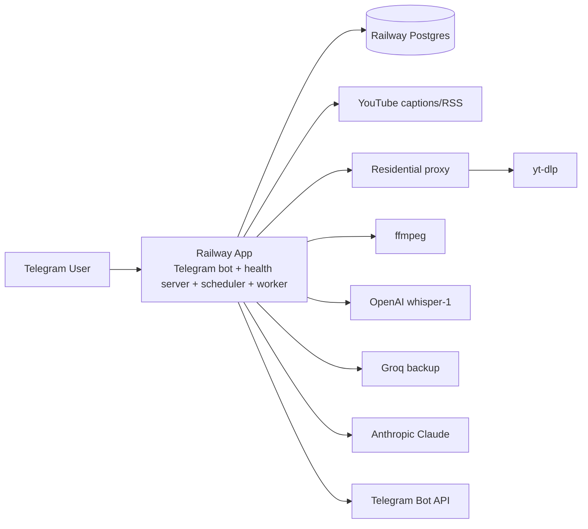
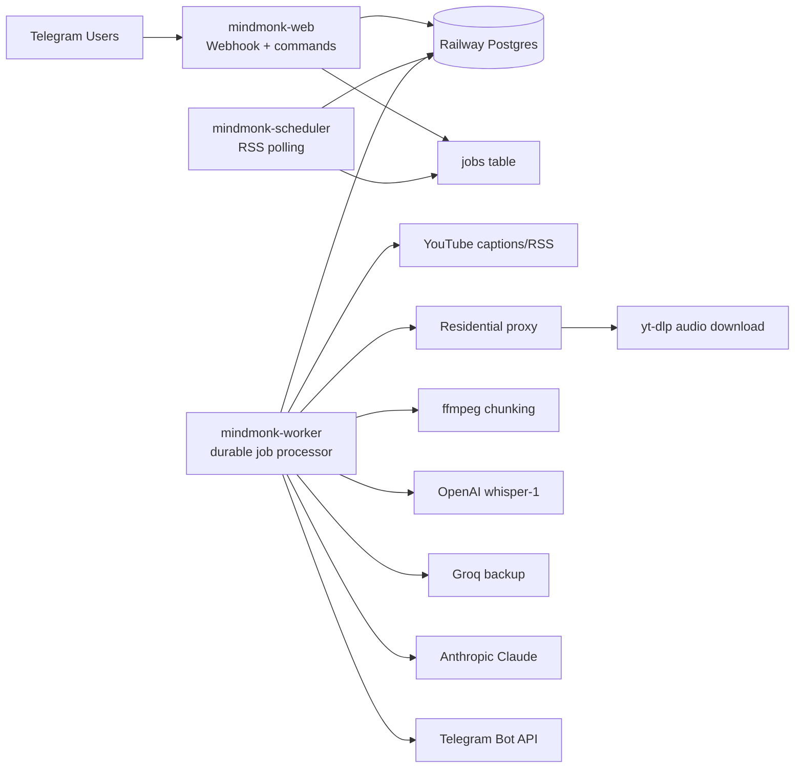
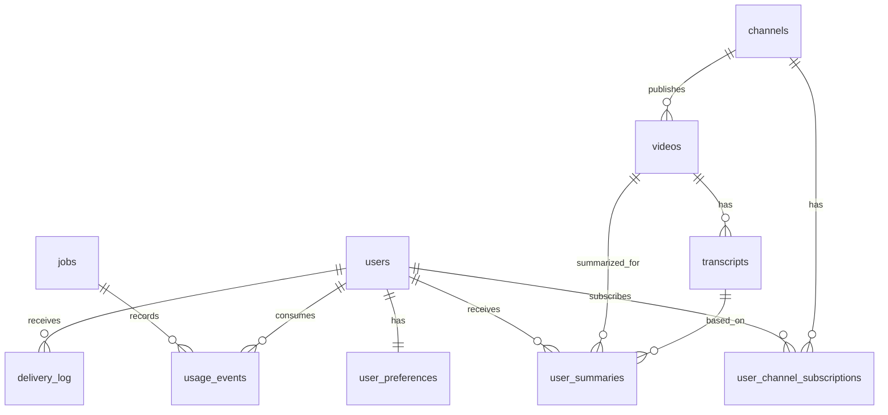
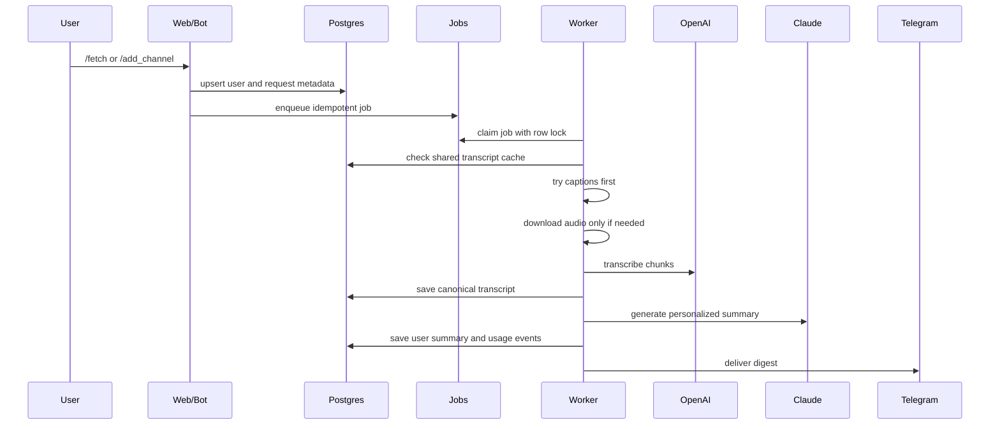

# MindMonk Architecture

Last updated: 2026-06-25

## Purpose

This is the main architecture reference for MindMonk. It documents:

- what exists in production today
- what the product should become
- how the system should scale to 1000 users
- which engineering practices should guide future work

Related planning docs:

- [Multiuser Scale Spec](./multiuser-scale-spec.md)
- [Multiuser Phased Delivery Plan](./multiuser-phased-delivery-plan.md)

## Product Summary

MindMonk is a Telegram-first YouTube and podcast digest product.

The product promise:

1. A user registers favorite YouTube channels or sends a video URL.
2. MindMonk obtains a transcript through a cost-aware waterfall.
3. MindMonk converts the transcript into a structured digest.
4. MindMonk grades the ideas with an LLM.
5. MindMonk tailors learnings to the user's profile.
6. MindMonk delivers the digest on Telegram.

Default output format:

1. Key insights
2. Patterns and anti-patterns
3. Unbiased grading of the ideas
4. Tailor-made learnings for the user's profile

## Current Production Architecture

### Runtime

The current production app runs as one Railway service:

- Node.js/TypeScript app
- Telegram bot
- health/landing HTTP server
- RSS scheduler
- processing worker loop
- Railway Postgres database

Public HTTP endpoints:

- `/` - landing page
- `/health` - health check

Current Telegram interface:

- `/start`
- `/add_channel`
- `/remove_channel`
- `/list_channels`
- `/fetch`
- `/channel`
- `/digest`
- `/set_context`
- `/set_format`
- `/reprocess`
- `/status`

### Current Components



### Current Transcript Waterfall

```text
YouTube captions
  -> if captions fail, download audio through proxy with yt-dlp
  -> split audio with ffmpeg
  -> transcribe chunks with OpenAI whisper-1
  -> if OpenAI fails, try Groq backup
  -> summarize with Claude
  -> deliver on Telegram
```

Important current behavior:

- If YouTube captions are available, the app does not download audio.
- If captions are missing, the app downloads audio into Railway container `/tmp`.
- Audio chunks are temporary and deleted after the job finishes.
- Transcript text is stored in Postgres as part of the summary row.
- Raw audio is not stored in Postgres.

### Current Data Model

Current tables:

| Table | Purpose |
|---|---|
| `channels` | Global YouTube channels |
| `videos` | Global YouTube videos |
| `summaries` | Generated summaries and raw transcript text |
| `brain_objects` | Extracted principles, patterns, rules, and playbooks |
| `user_context` | Single-owner context/preferences |
| `delivery_log` | Telegram delivery records |

Current constraints:

- `channels` are global and not user-owned.
- `user_context` is global, not per user.
- Telegram owner binding is single-owner.
- Queue processing is based on `videos.processed = false`.
- Queue locking is in-memory, so it does not work across multiple Railway replicas.
- On-demand `/fetch` can overlap with scheduled work.
- There is no durable job state, retry metadata, quota, billing, or usage ledger.

### Current Queue Behavior

The current scheduler:

- polls RSS every 20 minutes
- processes queued videos every 5 minutes
- fetches up to 3 unprocessed videos
- processes them one by one

This is acceptable for a private beta, but not enough for 1000 users.

## Target Architecture

The target architecture separates user-facing responsiveness from heavy processing.

### Target Services

| Service | Responsibility |
|---|---|
| `mindmonk-web` | Telegram webhook, user commands, landing page, health/readiness |
| `mindmonk-scheduler` | RSS polling and job creation |
| `mindmonk-worker` | Transcript fetching, audio download, transcription, summary generation, delivery |
| `Postgres` | Source of truth for users, subscriptions, videos, transcripts, jobs, usage |

For the first multiuser milestone, these can live in the same codebase. For 1000 users, deploy `web` and `worker` separately on Railway.



### Target Data Model



Target tables:

| Table | Purpose |
|---|---|
| `users` | Telegram user identity, plan, status |
| `user_preferences` | Profile, output format, delivery mode, per-user settings |
| `channels` | Canonical YouTube channel records |
| `user_channel_subscriptions` | Per-user channel subscriptions |
| `videos` | Canonical YouTube video records |
| `transcripts` | One canonical transcript per video/language |
| `user_summaries` | Personalized summary per user/video |
| `jobs` | Durable queue with locks, retries, payload, status |
| `usage_events` | Per-user and global usage/cost ledger |
| `delivery_log` | Per-user delivery state |

### Target Processing Flow



### Multiuser Principle

Expensive work should be shared; personalized work should be user-specific.

Shared/canonical:

- YouTube channel
- YouTube video
- transcript
- neutral metadata

User-specific:

- subscription
- profile/context
- output format
- personalized summary
- delivery record
- usage/quota

Example:

If 100 users ask for the same video:

- one `videos` row
- one transcript job
- one `transcripts` row
- up to 100 `user_summaries` rows
- up to 100 delivery records

## Durable Queue Design

The target queue should use Postgres row locks so multiple workers can run safely.

Job states:

- `queued`
- `processing`
- `succeeded`
- `failed`
- `dead`

Job fields:

- `type`
- `status`
- `priority`
- `run_after`
- `locked_by`
- `locked_until`
- `attempts`
- `max_attempts`
- `payload`
- `last_error`

Claim pattern:

```sql
WITH next_job AS (
  SELECT id
  FROM jobs
  WHERE status = 'queued'
    AND run_after <= now()
  ORDER BY priority ASC, created_at ASC
  FOR UPDATE SKIP LOCKED
  LIMIT 1
)
UPDATE jobs
SET status = 'processing',
    locked_by = $1,
    locked_until = now() + interval '15 minutes',
    attempts = attempts + 1,
    updated_at = now()
WHERE id = (SELECT id FROM next_job)
RETURNING *;
```

Recommended job types:

- `poll_channel`
- `fetch_transcript`
- `generate_user_summary`
- `deliver_summary`
- `extract_brain_objects`

## Concurrency and Cost Controls

Do not allow unlimited parallel audio downloads.

Recommended starting limits:

```text
MAX_AUDIO_DOWNLOAD_CONCURRENCY=2
MAX_TRANSCRIPTION_CONCURRENCY=3
MAX_SUMMARY_CONCURRENCY=5
MAX_DELIVERY_CONCURRENCY=10
MAX_JOBS_PER_USER=3
```

Recommended quota defaults:

| Tier | Channels | Manual Fetches | Auto Digests | Max Video Length |
|---|---:|---:|---:|---:|
| Free | 3 | 5/month | Off | 60 min |
| Beta | 20 | 100/month | Daily | 180 min |
| Admin | Unlimited | Unlimited | Instant/daily | 240 min |

Cost ledger should track:

- OpenAI transcription minutes
- Anthropic input/output tokens
- proxy bandwidth estimate
- audio download attempts
- failed expensive attempts
- Telegram delivery attempts

Hard safety caps:

- per-user monthly spend cap
- global daily transcription minute cap
- global daily LLM token cap
- max active jobs per user
- max video duration by tier

## Engineering Best Practices

### 1. Tenant Isolation

Every user-facing query must be scoped by `user_id`.

Rules:

- Never read or write preferences without `user_id`.
- Never list subscriptions globally for normal users.
- Never reuse another user's summary unless it is intentionally canonical and not personalized.
- Admin commands must be explicitly allowlisted.

### 2. Idempotency

Every command that creates work should have a stable idempotency key.

Recommended keys:

```text
fetch_transcript: video_id + language
generate_user_summary: user_id + video_id + profile_version + format_version
deliver_summary: user_summary_id + channel=telegram
poll_channel: channel_id + poll_window
```

### 3. Dedupe Expensive Work

The app should never download/transcribe the same video repeatedly because multiple users requested it.

Rules:

- Check `transcripts` before downloading audio.
- Lock or enqueue one transcript job per video/language.
- Share transcript across user summaries.
- Only reprocess transcript when explicitly forced by admin or a version change.

### 4. Safe External API Usage

External APIs must be treated as unreliable.

Required behavior:

- retry 429 and 5xx with exponential backoff
- respect `retry-after` when present
- record provider, status, and duration
- redact tokens, API keys, proxy URLs, and auth headers from logs
- mark permanent failures clearly

### 5. Bounded Resource Usage

All heavy operations need limits.

Limits to enforce:

- audio download concurrency
- ffmpeg concurrency
- transcription concurrency
- summary concurrency
- per-user active jobs
- global daily budget
- temp disk usage

### 6. Migrations

Move away from one large startup schema block as the product grows.

Use:

- numbered SQL migrations
- migration history table
- idempotent migration runner
- production DB backup before schema migration
- rollback notes for risky changes

### 7. Observability

Logs should be structured enough to debug without guessing.

Every job log should include:

```json
{
  "job_id": "...",
  "user_id": "...",
  "video_id": "...",
  "stage": "transcribe",
  "provider": "openai",
  "duration_ms": 1234
}
```

Metrics to track:

- queue depth by job type
- oldest queued job age
- jobs succeeded/failed/dead
- provider failure rates
- active downloads
- temp disk usage
- OpenAI audio minutes today
- Anthropic tokens today
- estimated cost today

### 8. Security

Rules:

- Store secrets only in Railway variables.
- Do not commit API keys or proxy URLs.
- Do not print secrets in logs or docs.
- Redact bearer tokens and proxy credentials.
- Keep raw audio temporary.
- Add a user deletion path before public launch.
- Add admin-only controls for budget overrides and reprocessing.

### 9. Testing

Minimum test suite:

- URL parsing tests
- transcript provider ordering tests
- user isolation repository tests
- job claim/lock tests
- quota enforcement tests
- Telegram command routing tests
- production smoke test for `/health` and `/ready`

Important UAT:

- two users can set different profiles
- two users can subscribe to the same channel
- same video creates one transcript and two personalized summaries
- quota stops expensive jobs before transcription
- worker crash leaves job retryable

### 10. Deployment

Deployment rules:

- Keep web and worker separable through `SERVICE_ROLE`.
- Web service must stay responsive while worker downloads audio.
- Use webhook mode for Telegram at scale.
- Deploy schema migrations before code paths that depend on them.
- Verify `/health`, `/ready`, and recent logs after deploy.
- Keep docs updated with major architecture changes.

## Implementation Phases

See [Multiuser Phased Delivery Plan](./multiuser-phased-delivery-plan.md) for detailed checklists and UATs.

Summary:

| Phase | Name | Outcome |
|---:|---|---|
| 0 | Baseline hardening | Current app stable and migration-safe |
| 1 | Multiuser identity | Users and preferences isolated |
| 2 | Subscriptions and dedupe | Shared channels/videos, per-user subscriptions |
| 3 | Durable queue | Jobs survive crashes and multiple workers |
| 4 | Transcript layer | One transcript per video reused across users |
| 5 | Personalized summaries | Per-user digest from shared transcript |
| 6 | Quotas and cost controls | Usage tracking and spend caps |
| 7 | Production service split | Separate web/worker services |
| 8 | 1000-user readiness | Load testing, alerts, launch checks |

## Current Versus Target

| Area | Current | Target |
|---|---|---|
| Users | Single owner | Multiuser `users` table |
| Preferences | Global `user_context` | Per-user `user_preferences` |
| Channels | Global only | Global channels plus per-user subscriptions |
| Videos | Global | Global and deduped |
| Transcripts | Stored in `summaries.raw_transcript` | Canonical `transcripts` table |
| Summaries | One summary per video | One personalized summary per user/video |
| Queue | `videos.processed=false` plus in-memory lock | Durable `jobs` table with row locks |
| Workers | One app process | Horizontally scalable workers |
| Audio | Temp `/tmp` in app container | Same, with queue limits and cleanup tracking |
| Cost tracking | None | `usage_events` and quotas |
| Deployment | One Railway service | Web, worker, scheduler services |
| Observability | Basic logs | Structured logs, metrics, admin status |

## Immediate Next Step

Build Phase 1 and Phase 2 first:

1. Add `users`.
2. Add `user_preferences`.
3. Add `user_channel_subscriptions`.
4. Scope commands to the current Telegram user.
5. Keep the current processing flow while user isolation is introduced.

Do not invite a broad user group before Phase 3 and Phase 6 are complete, because durable queueing and cost controls are what prevent runaway downloads/transcription spend.
