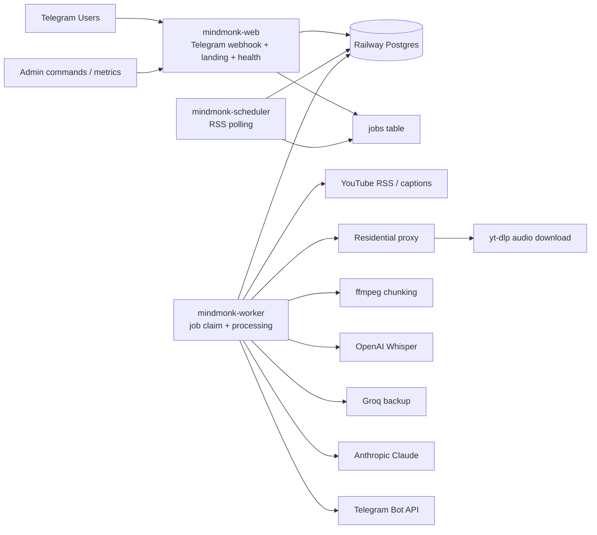
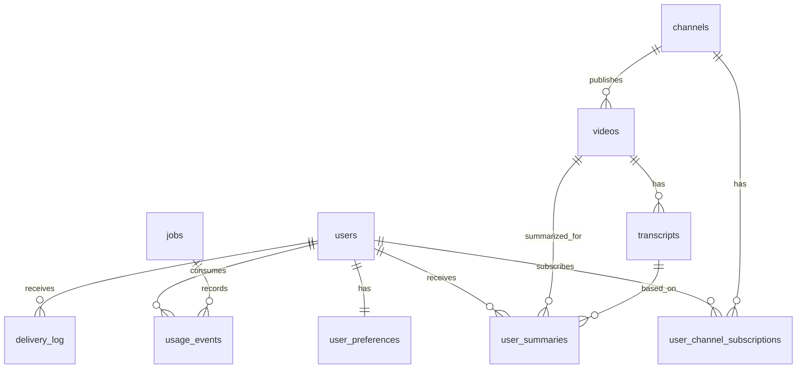
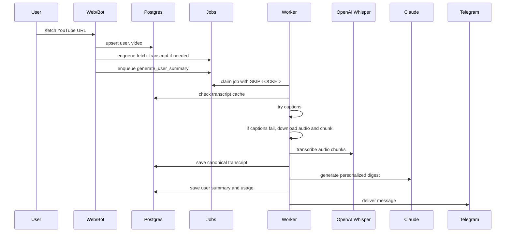

# MindMonk Multiuser Delivery Plan

## Purpose

This document breaks the multiuser scale spec into build phases, implementation checklists, UAT scenarios, and a target architecture.

Target outcome:

- Multiuser Telegram product.
- Ready for 1000 registered users.
- Controlled audio download/transcription spend.
- Shared transcripts, personalized summaries.
- Durable queue instead of ad hoc processing.
- Reasonable engineering practices for reliability, privacy, observability, and rollout.

## Product Definition

MindMonk helps users turn YouTube channels and podcasts into personalized learning digests.

Core user promise:

1. Add channels or fetch a specific video.
2. MindMonk obtains the transcript using a cost-aware waterfall.
3. MindMonk summarizes ideas in the user's preferred format.
4. MindMonk tailors learnings to the user's profile.
5. MindMonk delivers the digest in Telegram.

Default digest format:

1. Key insights
2. Patterns and anti-patterns
3. Unbiased grading of ideas
4. Tailor-made learnings for the user

## Target Architecture

### Component Diagram



### Runtime Services

| Service | Responsibility | Scale Notes |
|---|---|---|
| `mindmonk-web` | Telegram webhook, commands, landing page, health endpoints | Keep responsive; do not run heavy downloads here |
| `mindmonk-scheduler` | RSS polling and job creation | Can run as one replica initially |
| `mindmonk-worker` | Transcript, download, transcription, summary, delivery jobs | Can scale horizontally after DB row locks |
| `Postgres` | Users, subscriptions, videos, transcripts, jobs, usage | Source of truth |
| External APIs | YouTube, proxy, OpenAI, Anthropic, Telegram | Add rate limits and backoff |

For MVP, `web`, `scheduler`, and `worker` can still live in one codebase. For 1000 users, deploy web and worker as separate Railway services.

### Data Domain Diagram



### Processing Flow



### Transcript Waterfall

```text
1. YouTube captions
2. Audio download through residential proxy
3. OpenAI whisper-1
4. Groq backup provider
5. Mark transcript unavailable after bounded retries
```

The waterfall must be canonical per video. If 200 users ask for the same video, the app should download/transcribe it once, then reuse the transcript.

## Phase Overview

| Phase | Name | Main Outcome |
|---:|---|---|
| 0 | Baseline Hardening | Current app is stable, observable, and safe to migrate |
| 1 | Multiuser Identity | Users and preferences are isolated |
| 2 | Subscriptions and Dedupe | Shared channels/videos, per-user subscriptions |
| 3 | Durable Queue | Jobs survive crashes and multiple workers |
| 4 | Transcript Layer | One canonical transcript per video |
| 5 | Personalized Summaries | Per-user digests from shared transcripts |
| 6 | Quotas and Cost Controls | Spend cannot run away |
| 7 | Production Scale Split | Separate web/worker services and metrics |
| 8 | 1000-User Readiness | Load testing, UAT, launch readiness |

## Implementation Status

| Phase | Current Status | Notes |
|---:|---|---|
| 0 | Mostly implemented | `/health`, `/ready`, env validation, production docs, and schema assumptions exist. DB backup verification remains operational. |
| 1 | Implemented | `users`, `user_preferences`, per-user command routing, and legacy owner migration exist. |
| 2 | Implemented | `user_channel_subscriptions`, per-user add/list/remove, shared channels/videos, and subscriber lookup exist. |
| 3 | Implemented | Durable `jobs` table, row locks, retries, leases, worker loop, and decomposed transcript/summary/delivery/extraction jobs exist. Load testing remains. |
| 4 | Implemented | Canonical `transcripts` table exists and is reused per video/language. |
| 5 | Mostly implemented | `user_summaries`, per-user cached summaries, `/reprocess`, and delivery logs exist. Daily digest batching remains future work. |
| 6 | Implemented | `usage_events`, `/usage`, plan limits, manual fetch/channel guards, global caps, and cost/token recording exist. |
| 7 | Implemented | `SERVICE_ROLE=all|web|worker|scheduler`, web-mode job enqueueing, `/ready`, protected `/metrics`, and Railway web/worker/scheduler services exist. |
| 8 | In progress | `npm run scale:check`, `npm run ops:production-check`, `npm run ops:railway-check`, `npm run ops:queue-capacity`, and `docs/scale-runbook.md` exist. Actual staged user-load tests and backup restore drills still need to be run before broad launch. |

## Phase 0: Baseline Hardening

### Goal

Make the current single-owner system safe enough to migrate without losing functionality.

### Engineering Checklist

- [ ] Confirm current production deploy is healthy.
- [ ] Confirm GitHub `main` matches Railway production.
- [ ] Add a `/ready` endpoint that checks DB connectivity.
- [ ] Add structured log fields for `video_id`, `stage`, and `duration_ms`.
- [ ] Add env validation for all required production secrets.
- [ ] Move Telegram to webhook mode if possible.
- [ ] Add a simple admin-only `/admin_status` command.
- [ ] Add a DB backup before schema changes.
- [ ] Document existing tables and migration assumptions.

### Product Checklist

- [ ] Current commands still work: `/start`, `/fetch`, `/channel`, `/add_channel`, `/status`.
- [ ] Current owner receives summaries.
- [ ] Current waterfall remains intact.
- [ ] Landing page and health endpoint remain live.

### UAT Scenarios

| Scenario | Steps | Expected Result |
|---|---|---|
| Health check | Open `/health` | Returns HTTP 200 |
| Ready check | Open `/ready` | Returns DB ok and app ok |
| Caption video | Send `/fetch <video_with_captions>` | Summary delivered without audio download |
| No-caption video | Send `/fetch <video_without_captions>` | Audio fallback runs and summary delivered |
| Admin status | Send `/admin_status` as admin | Queue, provider, and DB status shown |
| Unauthorized admin | Send `/admin_status` from non-admin | Rejected |

### Definition of Done

- Production behavior matches current app.
- Logs identify each processing stage.
- DB backup exists.
- No new user-facing regressions.

## Phase 1: Multiuser Identity

### Goal

Replace single-owner state with per-user identity and preferences.

### Data Changes

Create:

- `users`
- `user_preferences`

Migrate:

- Existing owner chat into one `users` row.
- Existing global `user_context` profile into `user_preferences.profile_context`.
- Existing format into `user_preferences.output_format`.

### Engineering Checklist

- [ ] Add `users` table.
- [ ] Add `user_preferences` table.
- [ ] Implement `getOrCreateUserFromTelegram(ctx)`.
- [ ] Route every command through the Telegram user ID.
- [ ] Replace global owner gate with per-user allow/block status.
- [ ] Keep optional admin allowlist for admin commands.
- [ ] Update `/start` to create or reactivate a user.
- [ ] Update `/set_context` to save profile for the current user.
- [ ] Update `/set_format` to save format for the current user.
- [ ] Update `/status` to show the current user's status.
- [ ] Add tests or manual fixtures for two Telegram users.

### Product Checklist

- [ ] A new Telegram user can start the bot.
- [ ] Each user gets a private profile.
- [ ] Each user gets a private output format.
- [ ] Admin commands remain restricted.

### UAT Scenarios

| Scenario | Steps | Expected Result |
|---|---|---|
| First user signup | User A sends `/start` | User A row created |
| Second user signup | User B sends `/start` | User B row created separately |
| Context isolation | User A sets context, User B checks status | User B cannot see User A context |
| Format isolation | User A changes format, User B fetches digest | User B receives own/default format |
| Blocked user | Mark User B `blocked`, User B sends `/fetch` | Bot refuses politely |

### Definition of Done

- No global owner assumption remains in normal user commands.
- Two users can use the bot without data leakage.

## Phase 2: Subscriptions and Channel Dedupe

### Goal

Make channel subscriptions user-specific while keeping channel and video metadata shared.

### Data Changes

Create:

- `user_channel_subscriptions`

Modify behavior:

- `channels` remains global and unique by YouTube channel ID.
- `videos` remains global and unique by YouTube video ID.
- A user's relationship to a channel is stored only in `user_channel_subscriptions`.

### Engineering Checklist

- [ ] Add `user_channel_subscriptions`.
- [ ] Update `/add_channel` to subscribe current user.
- [ ] Update `/remove_channel` to unsubscribe current user only.
- [ ] Update `/list_channels` to show current user's channels only.
- [ ] Update `/channel <url>` to process latest video for current user.
- [ ] Ensure duplicate subscription is idempotent.
- [ ] Keep RSS polling over active global channels with at least one active subscriber.
- [ ] Add query helpers for active subscribers of a channel/video.

### Product Checklist

- [ ] Multiple users can subscribe to the same channel.
- [ ] One user removing a channel does not remove it for others.
- [ ] Channel metadata is not duplicated.

### UAT Scenarios

| Scenario | Steps | Expected Result |
|---|---|---|
| Shared channel | User A and User B add same channel | One `channels` row, two subscription rows |
| User-specific list | User A lists channels | Only User A channels shown |
| Remove isolation | User A removes channel | User B remains subscribed |
| Duplicate add | User A adds same channel twice | No duplicate subscription; friendly message |
| Latest channel fetch | User A sends `/channel <url>` | User A gets latest video summary |

### Definition of Done

- User subscriptions are isolated.
- Global channel/video dedupe works.

## Phase 3: Durable Queue

### Goal

Replace direct/in-memory processing with durable Postgres jobs that support retries, leases, and multiple workers.

### Data Changes

Create:

- `jobs`

Job types:

- `poll_channel`
- `fetch_transcript`
- `generate_user_summary`
- `deliver_summary`
- `extract_brain_objects`

### Engineering Checklist

- [ ] Add `jobs` table with status, attempts, `locked_by`, `locked_until`, `run_after`, payload.
- [ ] Implement `enqueueJob(type, payload, idempotencyKey)`.
- [ ] Implement `claimNextJob(workerId)` using `FOR UPDATE SKIP LOCKED`.
- [ ] Implement job status transitions: `queued`, `processing`, `succeeded`, `failed`, `dead`.
- [ ] Implement retry/backoff.
- [ ] Implement job lease expiry and recovery.
- [ ] Add per-resource concurrency limits.
- [ ] Convert scheduler to enqueue jobs instead of processing videos directly.
- [ ] Convert `/fetch` and `/channel` to enqueue or reuse jobs.
- [ ] Add admin queue status.

### Concurrency Defaults

```text
MAX_AUDIO_DOWNLOAD_CONCURRENCY=2
MAX_TRANSCRIPTION_CONCURRENCY=3
MAX_SUMMARY_CONCURRENCY=5
MAX_DELIVERY_CONCURRENCY=10
```

### UAT Scenarios

| Scenario | Steps | Expected Result |
|---|---|---|
| Job creation | Send `/fetch <url>` | `fetch_transcript` and summary jobs created |
| Single claim | Start two workers | Only one worker claims a given job |
| Crash recovery | Kill worker during job | Job returns to queue after lease expiry |
| Retry | Force provider 429 | Job retries with backoff |
| Dead letter | Force permanent failure | Job marks `dead` after max attempts |
| Queue status | Send admin status | Shows queued/processing/failed counts |

### Definition of Done

- No expensive work depends on an in-memory lock.
- Multiple workers can run without duplicate processing.

## Phase 4: Canonical Transcript Layer

### Goal

Store one transcript per video and reuse it across users.

### Data Changes

Create:

- `transcripts`

Deprecate:

- `summaries.raw_transcript` for new writes.

### Engineering Checklist

- [ ] Add `transcripts` table.
- [ ] Move transcript persistence out of `summaries`.
- [ ] Implement `getOrCreateTranscript(videoId)`.
- [ ] Ensure caption transcript saves as `source=captions`.
- [ ] Ensure Whisper transcript saves as `source=audio`, `provider=openai`.
- [ ] Store duration, char count, and estimated cost.
- [ ] Add transcript availability status to `videos`.
- [ ] Dedupe concurrent transcript jobs for the same video.
- [ ] Add cleanup of temporary audio after every success/failure.

### UAT Scenarios

| Scenario | Steps | Expected Result |
|---|---|---|
| Caption path | Fetch caption video | One transcript row with `source=captions` |
| Audio path | Fetch no-caption video | One transcript row with `source=audio`, provider OpenAI |
| Reuse path | User B fetches same video | No new audio download; existing transcript reused |
| Concurrent path | Two users fetch same video together | One transcript job wins; other waits/reuses |
| Failure path | Audio download fails | Job retries; no orphan audio remains |

### Definition of Done

- The app never downloads/transcribes the same video twice unless explicitly reprocessed.
- Audio files remain temporary.

## Phase 5: Personalized Summaries and Delivery

### Goal

Generate per-user summaries from shared transcripts and deliver them safely.

### Data Changes

Create:

- `user_summaries`

Modify:

- `delivery_log` should reference `user_id` and `user_summary_id`.

### Engineering Checklist

- [ ] Add `user_summaries`.
- [ ] Generate summaries using user profile and format.
- [ ] Reuse existing transcript.
- [ ] Upsert by `(user_id, video_id)`.
- [ ] Update `/fetch` to resend cached user summary if present.
- [ ] Add `/reprocess` for current user only.
- [ ] Add delivery job type.
- [ ] Add daily digest mode.
- [ ] Ensure Telegram message splitting handles long digests.
- [ ] Ensure delivery log records success/failure.

### UAT Scenarios

| Scenario | Steps | Expected Result |
|---|---|---|
| Personalized output | User A and User B have different profiles, fetch same video | Different tailored learnings |
| Cached resend | User A fetches same video twice | Second response uses cached user summary |
| Reprocess | User A sends `/reprocess <url>` | Only User A summary changes |
| Delivery failure | Simulate Telegram error | Delivery job retries |
| Daily digest | User has daily mode | Summaries are batched into one scheduled message |

### Definition of Done

- Shared transcript, personalized output.
- Delivery is retryable and logged per user.

## Phase 6: Quotas, Usage, and Cost Controls

### Goal

Prevent runaway API, proxy, and Railway cost.

### Data Changes

Create:

- `usage_events`
- optional `plans`
- optional `user_quota_windows`

### Engineering Checklist

- [ ] Add `usage_events`.
- [ ] Record OpenAI transcription minutes and estimated cost.
- [ ] Record Anthropic input/output tokens and estimated cost.
- [ ] Record proxy downloaded MB estimate.
- [ ] Record failed attempts for expensive operations.
- [ ] Add `/usage`.
- [ ] Add per-user monthly limits.
- [ ] Add global daily caps.
- [ ] Add max video duration per tier.
- [ ] Add max active jobs per user.
- [ ] Add admin override for trusted users.

### Suggested Initial Limits

| Tier | Channels | Manual Fetches | Auto Digests | Max Video Length |
|---|---:|---:|---:|---:|
| Free | 3 | 5/month | Off | 60 min |
| Beta | 20 | 100/month | Daily | 180 min |
| Admin | Unlimited | Unlimited | Instant/Daily | 240 min |

### UAT Scenarios

| Scenario | Steps | Expected Result |
|---|---|---|
| Usage display | User sends `/usage` | Shows current period usage |
| Free limit | Free user exceeds fetch limit | Bot refuses before expensive job |
| Duration limit | Free user fetches 3-hour video | Bot refuses or asks to upgrade |
| Global cap | Set low global cap, enqueue jobs | New expensive jobs pause |
| Cost event | Complete Whisper job | `usage_events` has audio minutes and cost |

### Definition of Done

- Every expensive operation is attributable.
- User and global caps stop runaway spend.

## Phase 7: Production Scale Split

### Goal

Run a production-shaped deployment that can handle traffic and heavy jobs separately.

### Infrastructure Checklist

- [ ] Create Railway service `mindmonk-web`.
- [ ] Create Railway service `mindmonk-worker`.
- [ ] Optionally create `mindmonk-scheduler`.
- [ ] Set `BOT_MODE=webhook`.
- [ ] Set Telegram webhook to web service.
- [ ] Disable heavy work in web service.
- [ ] Configure worker concurrency env vars.
- [ ] Add `/metrics` or protected admin metrics endpoint.
- [ ] Add alerts for job failure rate and queue age.
- [ ] Add DB backup schedule.

### Engineering Checklist

- [ ] Add service mode env var: `SERVICE_ROLE=web|worker|scheduler|all`.
- [ ] Web mode starts bot/webhook only.
- [ ] Worker mode starts job processor only.
- [ ] Scheduler mode starts RSS polling only.
- [ ] Add graceful shutdown for active jobs.
- [ ] Add worker heartbeat.
- [ ] Add temp disk usage logging.

### UAT Scenarios

| Scenario | Steps | Expected Result |
|---|---|---|
| Web-only service | Send Telegram command | Command responds quickly and enqueues job |
| Worker-only service | Stop worker, send `/fetch` | Job queues but no processing |
| Worker resume | Start worker | Queued job processes |
| Multiple workers | Run two worker replicas | No duplicate transcript/summary jobs |
| Web health | Open `/health` | Web healthy even while worker downloads audio |

### Definition of Done

- Web responsiveness is isolated from heavy processing.
- Workers can scale horizontally.

## Phase 8: 1000-User Readiness

### Goal

Validate launch readiness with realistic load, failures, and usage controls.

### Load Test Checklist

- [ ] Seed 1000 test users.
- [ ] Seed 2000-10000 subscriptions.
- [ ] Simulate shared channel subscriptions.
- [ ] Simulate 100 concurrent `/fetch` requests.
- [ ] Simulate RSS discovering 500 videos.
- [ ] Simulate provider failures and 429s.
- [ ] Verify queue drains under configured concurrency.
- [ ] Verify no duplicate transcript jobs.
- [ ] Verify quotas prevent excessive usage.
- [ ] Verify DB indexes keep queries fast.

### Operational Checklist

- [ ] Dashboards show queue depth, oldest job age, provider failures.
- [ ] Alerts fire for dead jobs.
- [ ] Alerts fire for global spend cap.
- [ ] Logs include `user_id`, `job_id`, `video_id`, and stage.
- [ ] DB backup restore has been tested.
- [ ] Secret rotation process documented.
- [ ] Admin runbook exists.

### UAT Scenarios

| Scenario | Steps | Expected Result |
|---|---|---|
| 1000 registrations | Simulate `/start` for 1000 users | All users created, no collisions |
| Popular video | 100 users fetch same video | One transcript, 100 user summaries |
| Quota pressure | 50 free users exceed limit | Expensive jobs not created |
| Provider outage | OpenAI fails for 15 min | Jobs retry/backoff, user notified if delayed |
| Worker crash | Kill worker during audio job | Job recovers after lease expiry |
| Privacy audit | Query User A data as User B path | No cross-user data exposed |

### Definition of Done

- System passes 1000-user simulation.
- Cost caps work.
- No duplicate expensive transcript work.
- Admin can operate incidents without shell-only debugging.

## Build Order Recommendation

Do not jump straight into 1000-user load work. The safest sequence is:

1. Phase 1: users/preferences.
2. Phase 2: subscriptions.
3. Phase 3: durable queue.
4. Phase 4: transcripts.
5. Phase 5: user summaries.
6. Phase 6: quotas.
7. Phase 7: service split.
8. Phase 8: load test.

The highest-risk phase is Phase 3, because queue semantics affect every expensive path. Build it carefully and test it hard.

## Implementation Milestones

### Milestone A: Multiuser Beta

Includes:

- Phase 1
- Phase 2
- minimal Phase 5

Supports:

- 10-50 trusted users
- manual `/fetch`
- per-user channels
- per-user profiles

Does not yet support:

- multiple workers
- robust retries
- strict cost controls

### Milestone B: Cost-Safe Worker

Includes:

- Phase 3
- Phase 4
- Phase 6 basics

Supports:

- transcript dedupe
- job retries
- limited concurrency
- usage tracking
- cost caps

Good for:

- 100-300 users

### Milestone C: 1000-User Launch Candidate

Includes:

- Phase 7
- Phase 8
- daily digest delivery
- observability

Good for:

- 1000 registered users
- controlled production growth

## Engineering Practices to Introduce

### Code Structure

Recommended modules:

```text
src/
  bot/
    commands/
    middleware/
  db/
    migrations/
    repositories/
  jobs/
    handlers/
    queue.ts
    worker.ts
  services/
    transcript/
    summary/
    delivery/
    usage/
  observability/
    logger.ts
    metrics.ts
```

### Testing

Add:

- unit tests for URL parsing and provider order
- repository tests for user isolation
- job claim tests for `SKIP LOCKED`
- integration tests for `/fetch`
- smoke test script for production health

### Migrations

Move schema creation away from one giant startup block.

Use:

- numbered SQL migrations
- idempotent migration runner
- migration history table
- backup before production migration

### Idempotency

Every command that creates work should use idempotency keys:

```text
fetch_transcript: video_id + language
generate_user_summary: user_id + video_id + format_version + profile_version
deliver_summary: user_summary_id + channel=telegram
```

### Observability

Every job log should include:

```json
{
  "job_id": "...",
  "user_id": "...",
  "video_id": "...",
  "stage": "transcribe",
  "provider": "openai",
  "duration_ms": 1234
}
```

### Safety Defaults

Start with conservative concurrency:

```text
MAX_AUDIO_DOWNLOAD_CONCURRENCY=2
MAX_TRANSCRIPTION_CONCURRENCY=3
MAX_SUMMARY_CONCURRENCY=5
MAX_JOBS_PER_USER=3
MAX_VIDEO_DURATION_SECONDS_FREE=3600
GLOBAL_DAILY_TRANSCRIPTION_MINUTES_CAP=1000
```

## Key Product Decisions Still Needed

1. Is the first public version Telegram-only?
2. What are the free, beta, and paid quotas?
3. Should automatic summaries be opt-in?
4. Should users bring their own API keys or should MindMonk bill users?
5. Should there be a web dashboard in the first paid version?
6. What is the max allowed video length by tier?
7. Should the product store full raw transcripts forever?

## Recommended Immediate Next Step

Build Milestone A first:

- users
- per-user preferences
- per-user subscriptions
- user-scoped `/fetch`, `/channel`, `/list_channels`

Then build Milestone B before inviting more than 50 users:

- durable jobs
- transcript dedupe
- usage tracking
- cost caps

That order lets the product become multiuser quickly without exposing you to runaway transcription cost.
